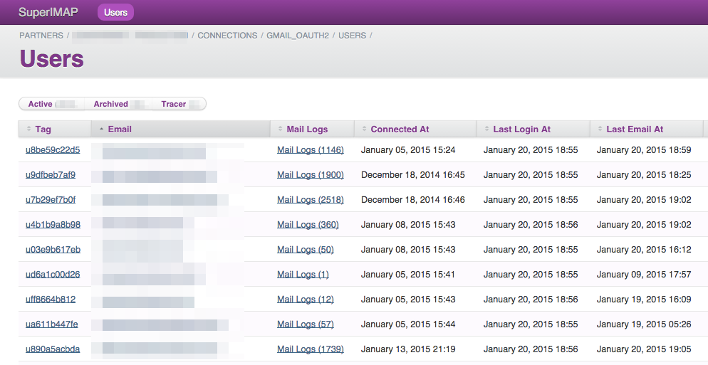

# SuperIMAP - Version 0.1.2

SuperIMAP helps you build email-driven applications. It takes care of
connecting to a customer's IMAP inbox, watching for new email, and
triggering a webhook to your application when a new email arrives,
typically within seconds.

SuperIMAP is built for
scale. [FiveStreet.com](https://www.fivestreet.com) built SuperIMAP as
an alternative to Context.io. It contains a subset of Context.io Lite
API functionality. As of July 2015, the FiveStreet team runs a
SuperIMAP cluster processing ~400k emails per day for thousands of
users.

SuperIMAP is written in Ruby and open sourced under the MIT license. [Why Ruby?](#why-ruby)

## Contents

* [Installation](#installation)
  * [Installing on Heroku](#installing-on-heroku)
  * [Installing Elsewhere](#installing-elsewhere)
* [Usage](#usage)
  * [Set up a Partner](#set-up-a-partner)
  * [Set up a Partner Connection](#set-up-a-partner-connection)
  * [Add and Connect a User](#add-and-connect-a-user)
  * [Add and Connect a User Programatically](#add-and-connect-a-user-programatically)
  * [Disconnect a User Programatically](#disconnect-a-user-programatically)
  * [Security](#security)
* [Webhooks](#webhooks)
  * [Webhook Security](#webhook-security)
  * [New Mail Webhook](#new-mail-webhook)
  * [User Connected Webhook](#user-connected-webhook)
  * [User Disconnected Webhook](#user-disconnected-webhook)
* [API](#api)
  * [Manage Partner Connections](#apiv1connections)
  * [Manage a Partner Connection](#apiv1connectionsimap_provider_code)
  * [Manage Users](#apiv1connectionsimap_provider_codeusers)
  * [Manage a User](#apiv1connectionsimap_provider_codeuserstag)
* [Operations](#operations)
  * [Process Types](#process-types)
  * [Why Ruby?](#why-ruby)
  * [Environment Variables](#environment-variables)
  * [Scaling](#scaling)
  * [Monitoring](#monitoring)
  * [Performance](#performance)
  * [Tracer Emails](#tracer-emails)
* [Appendix](#appendix)
  * [Understanding OAuth 2.0](#understanding-oauth-20)
  * [Understanding IMAP](#understanding-imap)
* [Development Tasks](#development-tasks)
  * [Running Unit Tests](#running-unit-tests)
  * [Running Stress Tests](#running-stress-tests)
  * [Future Work](#future-work)
  * [Contributions](#contributions)
* [Changes](#changes)
* [License](#license)

## Screenshot



## Installation

SuperIMAP was built to run on Heroku, but can run in any environment that supports Rails.

#### Installing on Heroku

1. Provision a new Heroku project.
2. Add an encrypted database.
3. Set the `SECRET_KEY_BASE` and `ENCRYPTION_KEY` environment
   variables to something really long and complicated.
4. Add a Heroku remote endpoint, and push the code.
5. Ramp up some workers.
5. Seed the database with  `heroku run rake db:setup db:seed`

Then, log in as the default user: `admin@example.com` / `password`.

**Remember: Change the username and password immediately!**

The production Procfile assumes that you are installing on Heroku. As
a result it has multiple definitions for the `imap_client` process
corresponding to different sized Heroku dynos. In order for load
balancing to work correctly, you should have all `imap_client`
processes use the same dyno size. Do not mix and match boxes.

#### Installing Elsewhere

1. Get the code: `git clone https://github.com/rustyio/super-imap.git`
2. Update `config/database.yml`. (Use `config/database.yml.example`)
3. Run `bundle` to install dependencies.
4. Set the `SECRET_KEY_BASE` and `ENCRYPTION_KEY` environment
   variables to something really long and complicated.
5. Seed the database with `RAILS_ENV=production rake db:setup db:seed`
6. Start the processes: `foreman start -c "web=1, worker=1, imap_client_1x=1`

Then, log in as the default user: `admin@example.com` / `password`.

**Remember: Change the username and password immediately!**

The production Procfile assumes that you are installing on Heroku. As
a result it has multiple definitions for the `imap_client` process
corresponding to different sized Heroku dynos. In order for load
balancing to work correctly, you should ensure that all `imap_client`
processes are the same size and point to the same database.

## Usage

#### Set up a Partner

A single SuperIMAP instance can support multiple applications (and/or multiple environments for a single application.) This is done by creating a new "Partner" for every different application (and/or environment).

1. Open the SuperIMAP dashboard.
2. Click on the "Partners" tab. Click "New Partner".
3. Set webhooks to notify your application of the following events:
   * A new email has arrived.
   * A user has connected their email account.
   * A user has disconnected their email account.

#### Set up a Partner Connection

1. Still within the dashboard, click the "Partners" tab.
2. Click on the "Connections" link next to your Partner.
3. Click on "New Partner Connection".
4. Choose an authentication type, and fill out any necessary credentials.

For Gmail, you will need to get OAuth 2.0 Client credentials here from the [Developer Console](https://console.developers.google.com/project).

#### Add and Connect a User

1. Still within the dashboard, click on "Partners".
2. Click on the "Connections" link next to your partner.
3. Click on the "Users" link next to your connection.
4. Click on the "New User" button.
5. Click the 'Connect' link to connect the user to an IMAP provider.
6. Send yourself email, and watch the logs!

#### Add and Connect a User Programatically

The next step is to update your application to handle the process of creating and connecting to SuperIMAP users. Here is some example code:

```ruby
    require 'rest-client'

    url = "https://my-app.com/api/v1/connections/GMAIL_OAUTH2/users"
    users = RestClient::Resource.new(url, :headers => {
      :'x-api-key'  => "$API_KEY$",
      :content_type => :json,
      :accept       => :json
    })

    # Create the user.
    users.post(:tag => "MY_USER")

    # Get the connect url.
    response = users["MY_USER"].get
    connect_url = JSON.parse(response)['connect_url']

    # Set up the success and failure callbacks.
    callbacks = {
      :success => "http://my-app.com/connect_callback?success=1",
      :failure => "http://my-app.com/connect_callback?failure=1"
    }

    # Redirect the user to the connect url.
    redirect_to connect_url  + "?" + callbacks.to_query
```

#### Disconnect a User Programatically

Below is sample code to disconnect a user:

```ruby
    url = "https://my-host.com/api/v1/connections/GMAIL_OAUTH2/users"
    users = RestClient::Resource.new(url, :headers => {
      :'x-api-key'  => "$API_KEY$",
      :content_type => :json,
      :accept       => :json
    })

    # Later, if you want to disconnect the user.
    response = users["MY_USER"].get
    disconnect_url = JSON.parse(response)['disconnect_url']

    # Set up the success and failure callbacks.
    callbacks = {
      :success => "http://my-app.com/disconnect_callback?success=1"
    }

    # Redirect the user to the disconnect url.
    redirect_to disconnect_url  + "?" + callbacks.to_query
```

#### Security

This is a good time to mention security. It is a big responsibility to
hold the keys to someone's email. Treat it with the appropriate amount
of caution.

If you use this code:

* *PLEASE* ensure that you use very strong, safeguarded passwords.
* *PLEASE* use enable 2-factor-authentication for your Heroku account.
* *PLEASE* make sure your entire database is encrypted at rest.

Other security measures within SuperIMAP:

+ SSL is *required* in production.
+ Secure fields (e.g. passwords and other credentials) are never exposed via the web interface, and are encrypted in the database.
+ Passwords are not recoverable by email.
+ Accounts are locked for an hour after three invalid password attempts.

## Webhooks

SuperIMAP sends new email events (and other events) to your
applications through webhooks:

+ All webhooks are dispatched through delayed jobs.
+ Webhooks will be retried up to 6 times, with exponential backoff.
+ Webhooks will fail if the receiving server takes more than 30 seconds to respond.
+ Webhooks expect a success response (HTTP code 200 - 206).
+ A "Forbidden" response code of 403 will automatically archive the user.
+ Any other response codes count as an error, and will trigger a retry.

#### Webhook Security

All webhooks are signed. You can validate the signature as follows:

```ruby
    # Parse the incoming JSON body.
    json_params = JSON.parse(request.raw_post)

    # Calculate expected signature.
    digest    = OpenSSL::Digest.new('sha256')
    api_key   = Rails.application.config.super_imap_api_key
    sha1      = json_params['sha1']
    timestamp = json_params['timestamp']
    expected_signature = OpenSSL::HMAC.hexdigest(digest, api_key, "#{timestamp}#{sha1}")

    # Get actual signature.
    actual_signature = json_params['signature']

    # Compare signatures.
    valid = expected_signature == actual_signature
```

#### New Mail Webhook

Called when a new mail arrives in a user's inbox.

+ `timestamp` - Timestamp the webhook was sent. Seconds since Jan 1, 1970.
+ `sha1` - The SHA1 hash of the rfc822 parameter.
+ `imap_provider_code` - The IMAP provider code (e.g. "GMAIL_OAUTH2")
+ `user_tag` - The user's tag.
+ `envelope - The email envelope, including date, subject, from, sender, reply_to, to, cc, bcc, in_reply_to, and message_id.
+ `rfc822` - The raw body of the email. http://www.w3.org/Protocols/rfc822/

#### User Connected Webhook

Called when a user has successfully authenticated with an IMAP
provider. Only applies to OAuth connections at the moment.

+ `timestamp` - Timestamp the webhook was sent. Seconds since Jan 1, 1970.
+ `sha1` - The SHA1 hash of the user's tag.
+ `imap_provider_code` - The IMAP provider code (e.g. "GMAIL_OAUTH2")
+ `user_tag` - The user's tag.
+ `email` - The email address with which the user authenticated.

#### User Disconnected Webhook

Called when a user has disconnected from an IMAP provider. Only
applies to OAuth connections at the moment.

+ `timestamp` - Timestamp the webhook was sent. Seconds since Jan 1, 1970.
+ `sha1` - The SHA1 hash of the user's tag.
+ `imap_provider_code` - The IMAP provider code (e.g. "GMAIL_OAUTH2")
+ `user_tag` - The user's tag.

## API

All API calls are scoped by partner. To authenticate, send the
Partner's API key using a header or a parameter. (A header is
preferred because it won't normally appear in HTTP logs.)

```sh
    # Access the API curl:
    curl -H "Accept: json" \
         -H "x-api-key:APIKEY" \
         https://my-host.com/api/v1/connections
```


```ruby
    # Access the API using the rest-client gem:
    url = "https://my-host.com/api/v1"
    resource = RestClient::Resource.new(url, :headers => {
      :'x-api-key'  => "$API_KEY$",
      :content_type => :json,
      :accept       => :json
    })
    resource['connections'].get
```
___

#### /api/v1/connections

**GET**

Get a list of connections for the specified partner.

**POST**

Create a new connection.

* `imap_provider_code` is required.
* Other required parameters depend on the IMAP Provider used.

___

#### /api/v1/connections/:IMAP_PROVIDER_CODE

**GET**

Get information about a given connection.

**PUT**

Update settings for a given connection. The required parameters depend on the IMAP provider used.

**DELETE**

Delete a connection and all underlying user data.

___

#### /api/v1/connections/:IMAP_PROVIDER_CODE/users

**GET**

Get a list of users for the specified IMAP Provider.

**POST**

Create a new user.

* `tag` - Required, a unique tag within the scope of a partner
  connection, selected by the partner application.
* Other required parameters depend on the IMAP Provider used.

___

#### /api/v1/connections/:IMAP_PROVIDER_CODE/users/:TAG

**GET**

Get information about the given user, including:

* `email` - The IMAP email address to which the user's account is connected.
* `connected_at` - The date when the user's account was connected. Present only if connected.
* `connect_url` - Redirect to this url to connect a user to a provider. For OAuth based IMAP providers, this begins the OAuth dance.
* `disconnect_url` - Redirect to this url to disconnect a user from a provider.

**PUT**

Update a user. The required parameters depend on the IMAP provider used.

**DELETE**

Archive a user. The user can be restored in the web interface, or by
updating the user (ie: a PUT request.

## Operations

#### Process Types

SuperIMAP consists of 3 different processes, all written in Ruby / Rails:

+ `web` - Serves the admin interface and the API.
+ `imap_client` - Handles the task of connecting to IMAP providers and listening for email.
+ `worker` - Processes background jobs generated by the 'imap_client' process.

#### Environment Variables

+ `ENCRYPTION_KEY` - If provided, used to encrypt passwords and secret keys. Required in production.
+ `MAX_USER_THREADS` - Change the maximum number of user threads. Default is 500.
+ `NUM_WORKER_THREADS` - Change the number of worker threads. Default is 5.
+ `MAX_EMAIL_SIZE` - Change the maximum email size. Default is 1 MiB (1,048,576 bytes).
+ `TRACER_INTERVAL` - Interval, in seconds, between outgoing tracer emails. Default is 600 seconds (10 minutes).
+ `NUM_TRACERS` - Number of tracers to send at the end of each tracer interval. Default is 3.

#### Scaling

To scale SuperIMAP, you will mainly want to increase the number of IMAP
Client processes. The IMAP Client processes automatically publish a
heartbeat every 10 seconds. Other instances look for this heartbeat
and re-calculate which neighboring processes are alive based on any
processes that have published a heartbeat within the last 30 seconds.

The IMAP Client processes re-balance users every 10 seconds. If no new
instances have entered or left the pool, then re-balancing will have
no effect.

If a new IMAP Client instance is started, then a small number of users
will be taken from each running instance and handed to the new
instance. If one of the IMAP Client instances is stopped it is removed
from the pool, then it's users will be evenly distributed to the
remaining instances (assuming they are still below the
`MAX_USER_THREADS` threshold.)

There is no "master" process that decides which IMAP Client process
should handle a given user. SuperIMAP uses a
[Rendezvous Hash](http://en.wikipedia.org/wiki/Rendezvous_hashing) to
allow IMAP Client instances to agree on how to evenly assign users
without any central coordination. The algorithm assumes that all
SuperIMAP instances have roughly the same number of resources.

#### Monitoring

SuperIMAP publishes some useful monitoring information in the logs.
This includes:

+ `imap_client.user_thread.count` - The size of the imap client work queue. Backups may indicate that your servers are overloaded.
+ `imap_client.total_emails_processed` - The total number of emails processed since the instance was started.
+ `imap_client.work_queue.length` - The number of user threads. This indicates how many users are connected on a given IMAP Client instance.
+ `work_queue.latency` - The latency, in seconds, between when an item is added to the work queue and when it is processed.

These metrics are published in a format that can be consumed by the
Librato Add-On in Heroku. See
https://devcenter.heroku.com/articles/librato#custom-log-based-metrics
for more information.

Apart from keeping an eye on these metrics, SuperIMAP should need no other regular metrics.

You may also want to keep an eye out for any failing Delayed Job tasks. You can view these from the Admin site.

#### Tracer Emails

SuperIMAP has the ability to give you useful monitoring information
through "tracer emails". The system will send a specially formatted
email to an account, wait for the incoming email, and log the
results. The logs can be accessed through the "Tracer Logs" tab.

To enable Tracer Emails, navigate to a user and check the "Enable
Tracer" checkbox. It is recommended that you create a few dummy email
addresses to use for tracer emails.

By default, a cluster of three tracers are sent every ten minutes from
each `imap_client` instance to a random tracer-enabled user managed by
that instance.

Keep in mind that this could generate a lot of email. Three emails
every ten minutes works out to ~430 emails per day.

#### Performance

SuperIMAP's architecture makes judicious use of system resources:

All connections to the IMAP server are managed by separate "user
threads", but these threads sit dormant most of the time. When
anything interesting happens that requires real work, the operation is
queued and handled by a worker in a worker pool. The size of the
worker pool is controlled by the `NUM_WORKER_THREADS` environment
variable. Only worker pools threads, and a small number of other
system threads, require a database connection.

In terms of tradeoffs, this architecture chooses to slightly degrade
an individual user's response time in favor of making sure that the
system will not get overloaded when things get rough. When things get
busy, the work simply builds up in the queue. The size of the worker
queue, and the queue latency, becomes a rough measure of system
health.

Typically, a SuperIMAP box is resource-limited by the number of user
processes that can be started. SuperIMAP requires 2 user processes for
each user's IMAP connection. On Heroku, the number of user processes
are limited at 256 for a 1X box, 512 for a 2X box, and 32,767 for a PX
box. You can set this at home using `ulimit -u`. Divide this in half
to get the maximum number of users that the SuperIMAP process can
manage.

[FiveStreet.com](https://www.fivestreet.com) uses SuperIMAP to manages
thousands of users and process over 1M incoming emails per week (as of
January 2015). We currently run this load on a single Heroku PX dyno,
with plenty of headroom. Our SuperIMAP instance serving thousands of
users requires just 10 database connections, uses about 3GB of RAM,
and has a 0.50 load average. The work queue usually sits near 0, with
a latency of < 0.5 seconds.

#### Why Ruby?

At first glance, and from a purely technical point-of-view, Ruby is a
poor choice for an application like SuperIMAP. SuperIMAP is highly
concurrent, and Ruby is bad at concurrency.

Specifically, the `imap_client` process spawns what could technically
be described as a "boatload" of threads (2 threads per connected user,
plus a handful of other threads). Ruby threads are heavyweight, so the
interpreter has to burn significant resources just to create and
schedule the threads before it can do any real work.

Using Erlang, Go, or Rust (all of which support lightweight threads
and actor-style programming) would have made the concurrent bits of
SuperIMAP less tricky to write, and would have required fewer
computing resources, possibly allowing a single box to handle tens of
thousands of active users.

So, why Ruby? A few reasons:

+ **FiveStreet uses Ruby** - The primary goal of SuperIMAP is to power
  a critical part of FiveStreet's application. FiveStreet.com is
  written in Ruby. It is built and maintained by a small team of Ruby
  engineers. Introducing a new language would force the team to spend
  dozens of hours learning a new stack and maintaining a new
  development environment.

+ **Low barrier to entry** - A secondary goal of SuperIMAP is to become
  a healthy open-source project. Based only on language popularity, it
  is more likely that another team can use, troubleshoot, and contribute to
  a Ruby-based SuperIMAP than an Erlang/Go/Rust-based SuperIMAP.

+ **For us, the cost savings are small** - FiveStreet's SuperIMAP
  cluster currently runs on three commodity servers and easily handles
  thousands of users. It's possible that if SuperIMAP were written in
  a different language, we could handle the load on a single machine,
  saving us a few hundred dollars a month. Not worth changing our
  stack for it.

+ **The concurrency is not complicated** - The concurrency in SuperIMAP is
  fairly straightforward -- one parent process, many child
  processes. It's a little painful to solve the problem in Ruby, but
  not impossible.

+ **Ruby has mature IMAP and OAuth 2.0 libraries** - Ruby has a
  [built-in IMAP library](http://ruby-doc.org/stdlib-2.0.0/libdoc/net/imap/rdoc/Net/IMAP.html),
  and a
  [widely-used OAuth 2.0 library](https://github.com/intridea/oauth2). As
  of 2015, the IMAP and OAuth 2.0 libraries for other languages are
  [far](https://github.com/alexcrichton/oauth2-rs)
  [less](https://github.com/boorad/erlimap)
  [mature](https://github.com/mxk/go-imap).

Side Note: This was a deeply considered choice. I (Rusty Klophaus, the
author of SuperIMAP) spent about 4 years writing Erlang
professionally. It's a fascinating language.

## Appendix

#### Understanding OAuth 2.0

SuperIMAP can authenticate to email providers using OAuth 2.0. OAuth
2.0 can be difficult to understand. Here is how it works, in the
context of a user authenticating to Gmail through SuperIMAP:

On your application:

* John visits a "Connect Your Email" page on your website.
* On the server side, your application uses the SuperIMAP API to fetch a special url called a `connect_url`. ([sample code](#add-and-connect-a-user-programatically))
* John clicks a link and is redirected to the `connect_url`.

On your SuperIMAP instance:

* The `connect_url` links to a SuperIMAP page.
* The SuperIMAP page construct a special URL and redirects to Google.

On Google:

* Google displays a page asking John to confirm certain permissions for your application.
* John clicks the "Approve" button.
* Google redirects John to SuperIMAP and includes a "refresh token" parameter.

On your SuperIMAP instance:

* SuperIMAP grabs the "refresh token", and issues a server side request for an "access token".
* SuperIMAP saves the "access token". This is what allows SuperIMAP to connect to Google on behalf of the user in the future.
* SuperIMAP redirects the user back to the "success" page provided in step #2 above.

On your application:

* Your application tells John that the connection was successful.

To get one step more complicated, OAuth is secured in a few different ways:

+ Google requires your application to pre-register callback URLS for your app. Sending the user back to a non-registered URL will fail.
+ The access token is tied to a client id and a client secret on our site. Someone needs all three to authenticate as the user.
+ There is more too it, but that's the extent of my knowledge.

If you want more detail, here's a video tutorial: https://www.youtube.com/watch?v=tFYrq3d54Dc

The OAuth settings are configured through the Google Developer console: https://console.developers.google.com/

#### Understanding IMAP

Once you are authenticated to an IMAP server, IMAP itself is a fairly
straightforward protocol. It consists of simple plain text commands
and responses. The commands and responses are tagged, allowing
multiple commands to run in parallel.

Below is a sample IMAP session, taken directly from the [Internet Message Access Protocol RFC (3501)](https://tools.ietf.org/html/rfc3501#section-8):

```
    S:   * OK IMAP4rev1 Service Ready
    C:   a001 login mrc secret
    S:   a001 OK LOGIN completed
    C:   a002 select inbox
    S:   * 18 EXISTS
    S:   * FLAGS (\Answered \Flagged \Deleted \Seen \Draft)
    S:   * 2 RECENT
    S:   * OK [UNSEEN 17] Message 17 is the first unseen message
    S:   * OK [UIDVALIDITY 3857529045] UIDs valid
    S:   a002 OK [READ-WRITE] SELECT completed
    C:   a003 fetch 12 full
    S:   * 12 FETCH (FLAGS (\Seen) INTERNALDATE "17-Jul-1996 02:44:25 -0700"
         RFC822.SIZE 4286 ENVELOPE ("Wed, 17 Jul 1996 02:23:25 -0700 (PDT)"
         "IMAP4rev1 WG mtg summary and minutes"
         (("Terry Gray" NIL "gray" "cac.washington.edu"))
         (("Terry Gray" NIL "gray" "cac.washington.edu"))
         (("Terry Gray" NIL "gray" "cac.washington.edu"))
         ((NIL NIL "imap" "cac.washington.edu"))
         ((NIL NIL "minutes" "CNRI.Reston.VA.US")
          ("John Klensin" NIL "KLENSIN" "MIT.EDU")) NIL NIL
          "<B27397-0100000@cac.washington.edu>")
          BODY ("TEXT" "PLAIN" ("CHARSET" "US-ASCII") NIL NIL "7BIT" 3028 92))
    S:    a003 OK FETCH completed
    C:    a004 fetch 12 body[header]
    S:    * 12 FETCH (BODY[HEADER] {342}
    S:    Date: Wed, 17 Jul 1996 02:23:25 -0700 (PDT)
    S:    From: Terry Gray <gray@cac.washington.edu>
    S:    Subject: IMAP4rev1 WG mtg summary and minutes
    S:    To: imap@cac.washington.edu
    S:    cc: minutes@CNRI.Reston.VA.US, John Klensin <KLENSIN@MIT.EDU>
    S:    Message-Id: <B27397-0100000@cac.washington.edu>
    S:    MIME-Version: 1.0
    S:    Content-Type: TEXT/PLAIN; CHARSET=US-ASCII
    S:
    S:    )
    S:    a004 OK FETCH completed
    C:    a005 store 12 +flags \deleted
    S:    * 12 FETCH (FLAGS (\Seen \Deleted))
    S:    a005 OK +FLAGS completed
    C:    a006 logout
    S:    * BYE IMAP4rev1 server terminating connection
    S:    a006 OK LOGOUT completed
```

SuperIMAP uses the IDLE command to wait for incoming email, defined in
the
[IMAP4 Idle Command RFC (2177)](https://tools.ietf.org/html/rfc2177). The
IMAP client sends an IDLE command to the server and awaits a
response. When an IMAP connection is in IDLE mode, no other commands
are allowed.

## Development Tasks

The information below is mainly intended at developers who want to modify the SuperIMAP codebase.

#### Running Unit Tests

Run this once:

    RAILS_ENV=test rake db:setup db:seed

Then run all tests:

    rake test:all

#### Running Stress Tests

The stress test exercises the multi-threaded aspects of SuperIMAP, as
well as the error recovery code. To do this, we point the SuperIMAP IMAP
client code against a local IMAP server and generate a bunch of fake emails
for many users.

Additionally, the IMAP server generates 'chaotic' events; it will
intentionally generate incorrect or gibberish responses. The SuperIMAP
IMAP client code is expected to recover gracefully while using a
minimal amount of system resources.

Run this once:

    RAILS_ENV=stress rake db:setup db:seed

Then run the stress test:

    script/stress-test

#### Future Work

* Configure stress test to report code coverage.
* Make a way to "sweep" a user's inbox, generating webhook events for all emails.

#### Contributions

To contribute to this project, please fork and file a pull
request. Small patches will be accepted more quickly than large
patches.

## Changes

#### Version 0.1.2

* Re-organize and improve documentation in README.md.
* Detect and handle race condition around changing UIDVALIDITY.
* Properly escape OAuth 2.0 disconnect URL.
* Improve usage of Rails connection pool.
* Clean up heartbeat records during exit.
* Synchronize access to shared objects.

## License

The MIT License (MIT)

Copyright (c) 2015 Rusty Klophaus / FiveStreet.com

Permission is hereby granted, free of charge, to any person obtaining a copy
of this software and associated documentation files (the "Software"), to deal
in the Software without restriction, including without limitation the rights
to use, copy, modify, merge, publish, distribute, sublicense, and/or sell
copies of the Software, and to permit persons to whom the Software is
furnished to do so, subject to the following conditions:

The above copyright notice and this permission notice shall be included in
all copies or substantial portions of the Software.

THE SOFTWARE IS PROVIDED "AS IS", WITHOUT WARRANTY OF ANY KIND, EXPRESS OR
IMPLIED, INCLUDING BUT NOT LIMITED TO THE WARRANTIES OF MERCHANTABILITY,
FITNESS FOR A PARTICULAR PURPOSE AND NONINFRINGEMENT. IN NO EVENT SHALL THE
AUTHORS OR COPYRIGHT HOLDERS BE LIABLE FOR ANY CLAIM, DAMAGES OR OTHER
LIABILITY, WHETHER IN AN ACTION OF CONTRACT, TORT OR OTHERWISE, ARISING FROM,
OUT OF OR IN CONNECTION WITH THE SOFTWARE OR THE USE OR OTHER DEALINGS IN
THE SOFTWARE.
